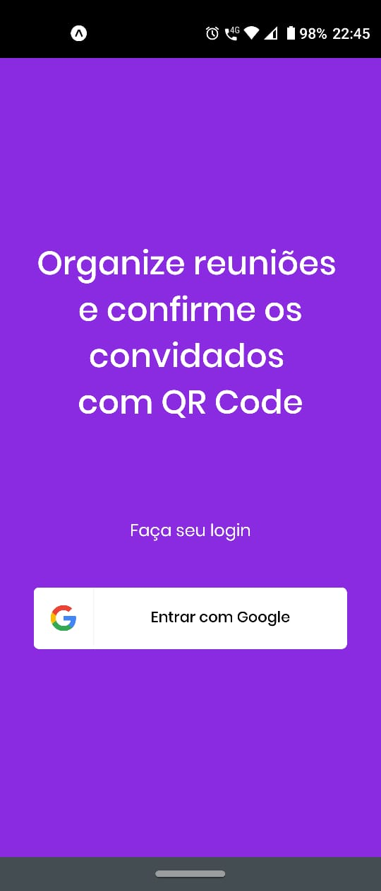
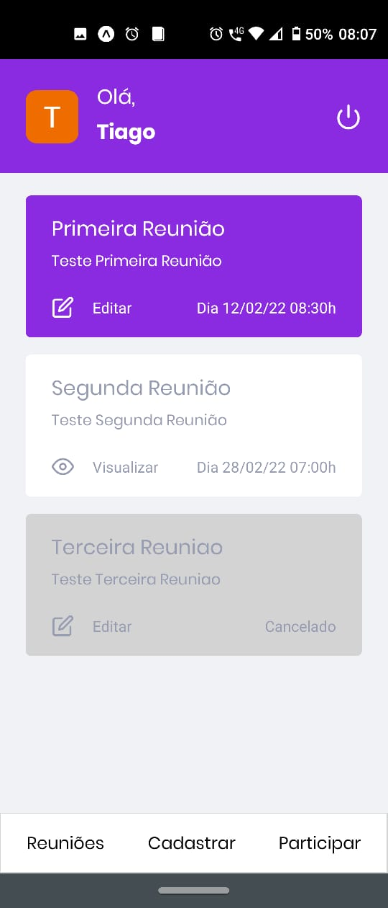
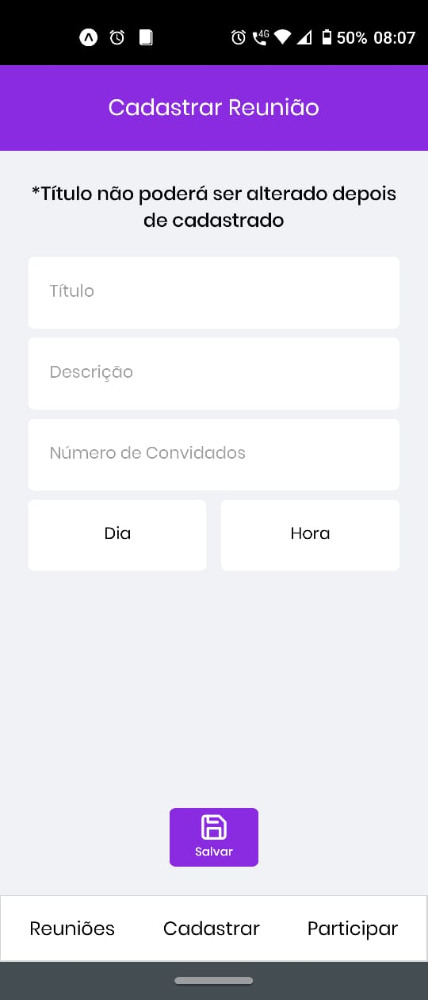
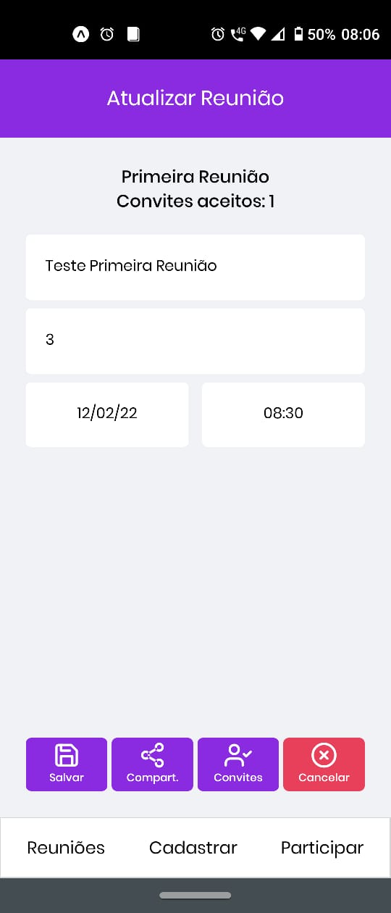
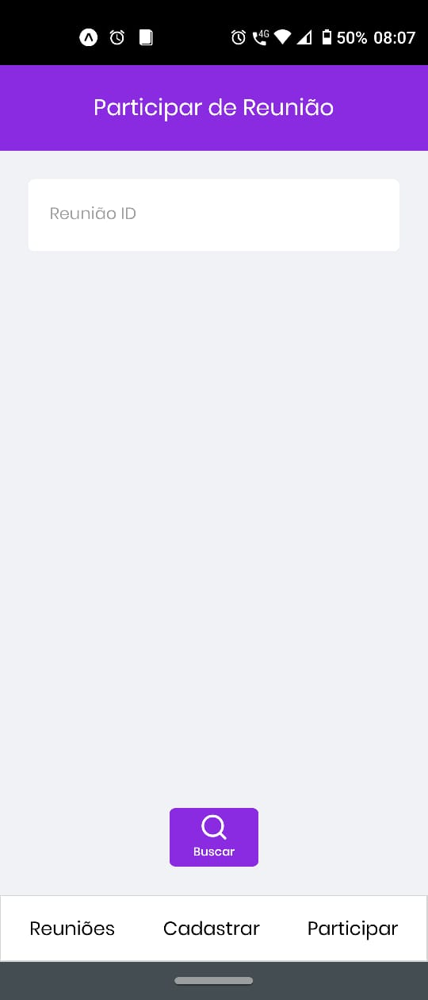
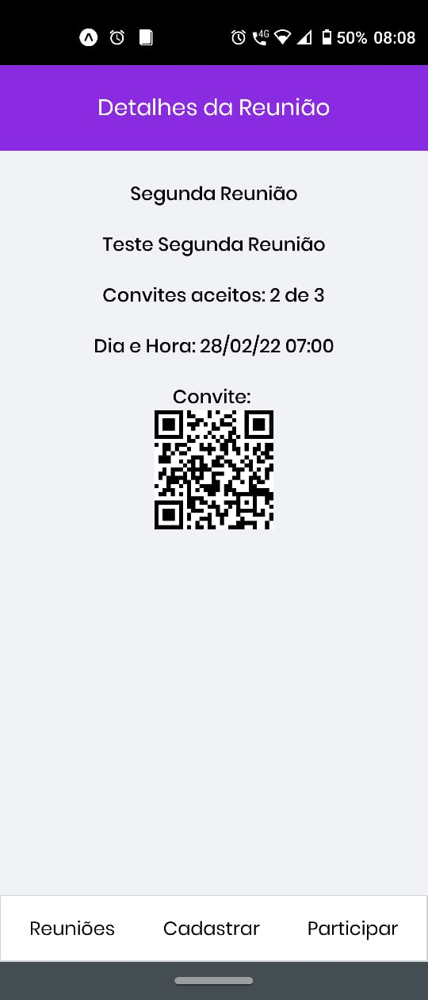
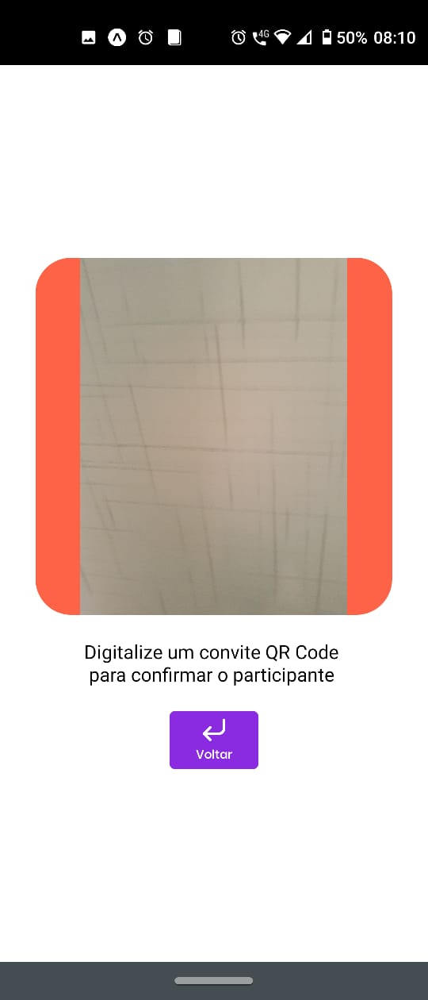

<div align="center">
  <h1> Check Me In </h1>
</div>

<p align="center">
  

  
</p>

<p align="center">
  
  
  
  
  
  
  
</p>

## 🎮 O Projeto

É um projeto de estudos criado para colocar em prática o conhecimento obtido nas tecnologias aqui utilizadas.

## 📱Check Me In

CheckMeIn é um aplicativo para Android e ~~IOS (em breve)~~.

Permite você criar uma reunião / evento / show e enviar um link com o convite aos seus participantes. No dia do evento, o participante apresentará um QRCode pelo App CheckMeIn e você fará a leitura pelo mesmo App confirmando se ele está entre os convidados ou não.

## 🧪 Principais Tecnologias
- NodeJS
- Express
- TypeScript
- Prisma
- Atlas MongoDB
- Sentry
- Firebase
- React Native / Expo

## 🚀 Instalação
```
$ git clone https://github.com/gonribeiro/CheckMeIn.git # clone o repositório
```

### Backend

```
# Server
$ cd CheckMeIn/server # acesse
$ yarn # instale
# Copie env.example renomeando para .env. Siga as instruções existentes no .env.
$ yarn dev # inicie
# Veja as rotas disponíveis e parâmetros aceitos no Swagger: http://localhost:3333/api-docs
```

### Frontend
```
# Mobile
$ cd CheckMeIn/mobile # acesse
$ yarn # instale
# Copie env.example renomeando para .env. Siga as instruções existentes no .env.
$ expo start # inicie o aplicativo pelo seu dispositivo android ou virtualize com Android Studio
```

## 😷 Backlog
- Lidar com refrash token
- Organizador deveria receber aviso quando convite for aceito por participante
- Organizador deveria recusar um convite aceito quando não reconhecido por ele
- Organizador poderia ter acesso uma lista com o nome e email dos participantes
- Participante deveria ser notificado quando reunião estiver próxima ou for cancelada
- Participante poderia cancelar sua participação do evento e organizador deveria ser notificado
- Ao compartilhar reunião, deveria haver um link que encaminha diretamente para o App na tela de aceitar o convite ([Solução?](https://blog.rocketseat.com.br/configurando-deep-linking-no-react-native/))
- Backend deveria ser consultado somente pelo App ([Solução?](https://stackoverflow.com/questions/60559419/how-to-secure-an-api-rest-for-mobile-app-if-sniffing-requests-gives-you-the-k))
- Permitir login via Apple e/ou Facebook
- Adaptar App para IOs
- Criar os testes de Back e Front

## 📝 Licença

Este projeto está licenciado sob a Licença MIT. Consulte o arquivo [LICENSE](LICENSE.md) para obter detalhes.

---

<p align="center">Made with 💜 by Tiago Ribeiro</p>
